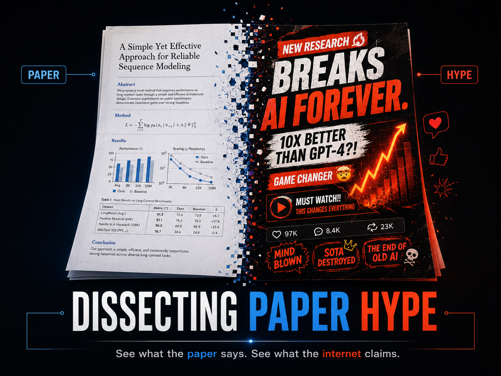

<p align="center">
  
</p>

# 拆解論文營銷號（Dissecting Paper Hype）

*一個用於「AI 論文吹捧」媒體識讀的 [Claude Code](https://claude.com/claude-code) skill。*

English → [README.md](./README.md)

---

Threads、X 等動態牆充斥著「拿一篇真論文、吹成『這將改變一切／你的飯碗不保』」的營銷號貼文。這個 skill 幫你**識破它們**——而且是雙向的。

## 三種模式

### Mode A — 實驗模式（論文 → 營銷號 → 拆解）
給一個研究領域(或你自己的筆記),它派 sub‑agent 找出**真實存在**的論文,每篇產出:
- 一段誠實的**白話摘要**(含真實限制),以及
- 一篇刻意誇大的**營銷號改寫**(聳動標題 + 吹捧內文),

再用 6 維 rubric 替每篇評分,並寫出一份分析報告,整理反覆出現的**手段、高頻關鍵詞、句式模板**。用「重建吹捧」的方式來學會這套操弄劇本。

> ⚠️ 每篇產出的營銷號都有免責標頭,標明是**受控媒體識讀示範、非真實評價**。本 skill **不**用於產出可發布的行銷文案——該用途會被倫理硬關卡婉拒。

### Mode B — 快篩模式（貼文 → 0–100 營銷號分數）
貼一則 Threads/X 貼文(URL 或內文)問「這是營銷號嗎」。skill 會:
1. **取文**(Docker/Scrapling 容器,或你直接貼上),
2. **拆解**出宣稱、引用的論文/repo、話術訊號,
3. **深度查證**——派 sub‑agent **實際開啟**每個 arXiv/GitHub 連結,比對「貼文宣稱 vs 原文實際」以及被略去的限制,
4. **評分** 0–100(7 維 rubric)並給出判決。

查證這一步才是重點:它抓得到最常見的伎倆——**真數字 + 抽掉前提**——這是純關鍵詞掃描(或憑記憶亂猜)做不到的。

#### 營銷號評分 rubric（0–100,越高越可疑）
| 維度 | 看什麼 | 配分 |
|---|---|---|
| A | 標題/開場聳動 | 15 |
| B | 宣稱 vs 原文落差 *(靠查證)* | 15 |
| C | 數字抽前提 / 比較錯位 | 15 |
| D | 隱瞞限制 *(靠查證)* | 15 |
| E | 情緒操弄(失業/健康/FOMO/民族) | 15 |
| F | 假權威 / 假社會證明 | 15 |
| G | 來源不可查證 | 10 |

燈號:**0–25 🟢 值得讀 · 26–50 🟡 自己查證再信 · 51–75 🟠 高度存疑 · 76–100 🔴 典型營銷號,滑掉。**

> 一個你查得到的真數字**不是罪**;捏造的、或抽掉前提的真數字才是。**熱情 ≠ 營銷號**——分數懲罰的是「落差」與「隱瞞」。

### Mode C — 論文採信風險快篩(讀者自保)
給一個論文連結(arXiv/DOI/URL)問「這篇可信嗎 / 有沒有造假」。它查論文**本身**的誠信——**幻覺/不存在引用、殘留 AI 生成文字、tortured phrases、撤稿/PubPeer 狀態、掠奪性期刊**——回一個 0–100 **採信風險**分數 + 證據卷宗。範圍限於**你自己**的判斷(信不信/引不引),**非公開指控**:每條旗標都是可查證線索,「查不到 ≠ 造假」,乾淨分數 ≠ 論文正確。

## Mode B 示範
對一則介紹 Perplexity「Search as Code」架構的真實 X 長文問「這是營銷號嗎」,Mode B 取文後實際開啟 Perplexity 原始研究文章核對,給出這份判決:

> ### 🟡 營銷號分數:27 / 100 — *自己查證再信*
> **判決:** 一篇誠實、用心的技術摘要——每個引用數字都與原文吻合、語氣克制、來源可查。唯一真缺陷:把**廠商自家的第一方評測(WANDR 當時還沒公開)當成客觀結果呈現**。可以讀,但要知道這是誰家的計分板。
>
> | 維度 | 得分 | 原因 |
> |---|---|---|
> | A · 標題聳動 | 4/15 | 「下一次范式轉移」略誇;無震驚體 |
> | B · 宣稱vs原文落差 | 4/15 | 每個引用數字都與原文一致 |
> | C · 數字抽前提 | 7/15 | 「對手<25%」「2.5倍」皆廠商自跑對照 |
> | D · 隱瞞限制 | 8/15 | 略去:自家設計基準、無第三方驗證 |
> | E · 情緒操弄 | 1/15 | 無 FOMO / 失業 / 喊轉發 |
> | F · 假權威 | 2/15 | 引用真實來源(但來源=廠商本人) |
> | G · 來源不可查證 | 1/10 | 原文完全可查證 |
>
> **查證步驟:** 開啟 `research.perplexity.ai/...` → `100% 準確率` ✓ · `token −85.1%` ✓ · `WANDR 2.5 倍` ✓ ——每個數字都真,但 WANDR 是 Perplexity 自家基準、發文時尚未公開。

<!-- 想放真截圖?把 PNG 放到 assets/mode-b-demo.png,再把上面這段換成:  -->

## 需求
- **Claude Code**(這是一個 skill,會用到 `Skill` 工具、sub‑agent、網路存取)。
- Mode B 深度查證需要網路(`WebFetch`/`WebSearch`)。
- 抓 JS 重的社群貼文需要 **Docker**(選用——你永遠可以直接貼上貼文文字)。

## 安裝

### 方式 A — 讓 AI agent 自己安裝(推薦)
把下面這段 prompt 貼給 Claude Code(或任何有 shell 權限的 coding agent),它會自己把 skill 裝好:

```text
請從 https://github.com/GMfatcat/Paper-Hype 安裝「dissecting-paper-hype」這個 Claude Code skill:

1. 把 repo clone(或下載)到暫存位置。
2. 把它的 `skill/` 目錄複製到我的個人 skills 目錄,使結果為
   ~/.claude/skills/dissecting-paper-hype/  且內含 SKILL.md、references/、scrapling-fetcher/。
   (Windows:%USERPROFILE%\.claude\skills\dissecting-paper-hype\)
3. 選用 — 建置取文器:在 skill/scrapling-fetcher 執行  `docker build -t hype-fetcher .`
4. 確認目標路徑下有 SKILL.md,然後讀它並把兩種模式摘要回報給我。
```

### 方式 B — 手動
```bash
# macOS / Linux
git clone https://github.com/GMfatcat/Paper-Hype
cp -r Paper-Hype/skill ~/.claude/skills/dissecting-paper-hype

# Windows (PowerShell)
git clone https://github.com/GMfatcat/Paper-Hype
Copy-Item -Recurse Paper-Hype\skill "$env:USERPROFILE\.claude\skills\dissecting-paper-hype"
```

之後在 Claude Code 裡自然詢問即可——skill 會在出現「做營銷號實驗」「把論文寫成吹捧版」(Mode A)或「這篇貼文是營銷號嗎 / is this post hype? <URL>」(Mode B)等說法時觸發。

## Docker 取文器（Mode B 取文）
封裝 [Scrapling](https://github.com/D4Vinci/Scrapling),免在本機裝 Python/Playwright。
```bash
cd skill/scrapling-fetcher
docker build -t hype-fetcher .
docker run --rm hype-fetcher "https://www.threads.com/@user/post/XXXX"
```
輸出一個 JSON;用 `post_text` + `text_excerpt` 當貼文正文。**實測(2026‑06)**:stealth fetcher(camoufox,跑 JS)成功抓到**公開 Threads** 貼文完整正文與 arXiv 頁面;**X(Twitter)登入牆**常只剩殘缺 → 改用貼上。詳見 [skill/scrapling-fetcher/README.md](./skill/scrapling-fetcher/README.md)。

## 目錄結構
```
skill/                     可安裝的 Claude Code skill
  SKILL.md                 模式、pipeline、rubric、硬規則
  references/templates.md  sub‑agent prompt + 報告格式
  scrapling-fetcher/       Docker 化取文器(Dockerfile + fetch.py)
examples/                  實驗數據——25 領域、75 篇營銷號
  batch1-niche-ai/         10 個冷門領域(KAN、SNN、Liquid NN…)
  batch2-mainstream/       5 個主流領域(Agents、RAG、Diffusion…)
  batch3-hot/              10 個熱門領域(量化、MoE、對齊安全、AI4Science…)
  cross-batch-playbook.md  三批合併的隨身防騙手冊
```

## 倫理與免責
`examples/` 內含對真實論文的**刻意捏造**吹捧改寫,作為教學反面教材。每個檔案開頭都有中文免責標記,表明這是受控示範。**請勿擷取任何「營銷號版」當作對論文的真實評價發布。** 這個 skill 的存在是為了**偵測與拆解**營銷號,絕非製造它。

## 致謝
Mode B 的取文器建構於 [**Scrapling**](https://github.com/D4Vinci/Scrapling)(作者 Karim Shoair / [@D4Vinci](https://github.com/D4Vinci))——一個能處理 JS 渲染與反爬的自適應網路爬蟲框架,正是它讓抓取即時 Threads/X 貼文成為可能。本專案僅在 Docker 容器內**呼叫** Scrapling(見 `skill/scrapling-fetcher/`),未內嵌或修改其原始碼。

## 授權
本專案採 [MIT 授權](./LICENSE) © 2026 GMfatcat。

**第三方授權:**
- [Scrapling](https://github.com/D4Vinci/Scrapling) — **BSD‑3‑Clause** © Karim Shoair。
- Docker 映像另安裝 Python、Playwright / camoufox 及其相依套件,各依其原始授權。
